# 🎄 Manual de uso — Lotería Tracatá

Guía para la persona que va a llevar la lotería en el día a día. No hace falta saber
nada de informática: todo se hace desde el móvil, tocando botones.

> Las imágenes de este manual están hechas con una **campaña de ejemplo**
> (5 establecimientos, 150 décimos), así que los números que veas en tu aplicación
> serán distintos. Los botones y las pantallas son exactamente los mismos.

---

## Índice

1. [Qué hace esta aplicación](#1-qué-hace-esta-aplicación)
2. [Entrar e instalarla en el móvil](#2-entrar-e-instalarla-en-el-móvil)
3. [La pantalla de Inicio](#3-la-pantalla-de-inicio)
4. [Cómo moverte por la aplicación](#4-cómo-moverte-por-la-aplicación)
5. [El día a día: vender, contar y recoger el dinero](#5-el-día-a-día-vender-contar-y-recoger-el-dinero)
6. [Operaciones del administrador](#6-operaciones-del-administrador)
7. [Consultar y comprobar](#7-consultar-y-comprobar)
8. [Si eres responsable de un bar](#8-si-eres-responsable-de-un-bar)
9. [Preguntas frecuentes](#9-preguntas-frecuentes)
10. [Chuleta rápida](#10-chuleta-rápida)

---

## 1. Qué hace esta aplicación

Lleva la cuenta de la **Lotería de Navidad** repartida entre varios bares y restaurantes:
cuántos décimos hay en cada sitio, cuántos se han vendido, cuánto dinero debería haber en
cada caja, cuánto vas recogiendo y cuánto se acumula para la fiesta del personal.

**Las cuentas, en tres líneas:**

| Concepto | Importe |
| --- | --- |
| Cada décimo **se compra** a | 20,00 € |
| Cada décimo **se vende** a | 23,00 € |
| La diferencia (3,00 €) va al | **Fondo Fiesta** |

Esos precios son los de la campaña de ejemplo y se pueden cambiar en **Configuración**;
la aportación a la fiesta siempre es «precio de venta − precio de compra».

**Dos cajas distintas, que no se mezclan:**

- **Caja de lotería de cada establecimiento**: el dinero de la lotería vendida que todavía
  está en el bar. Sube con cada venta y baja cuando pasas a recogerlo.
- **Caja central**: el dinero del proyecto. Entra lo que recoges de los bares (y lo que
  pongas tú), y sale lo que gastas comprando más lotería o en la fiesta.

**Tres reglas que conviene tener claras desde el principio:**

1. **Nada se borra nunca.** Si te equivocas, se *anula* el movimiento: la aplicación crea el
   movimiento contrario y en el histórico quedan los dos.
2. **La aplicación nunca cuadra las cuentas por su cuenta.** Si en una caja falta dinero,
   la diferencia sigue viva hasta que se resuelva.
3. **Todo queda registrado** con la fecha y la persona que lo hizo.

---

## 2. Entrar e instalarla en el móvil

Escribe tu correo y tu contraseña y pulsa **Entrar**. Si te equivocas, la aplicación te lo
dice; si tu usuario no está dado de alta, avisa al administrador.

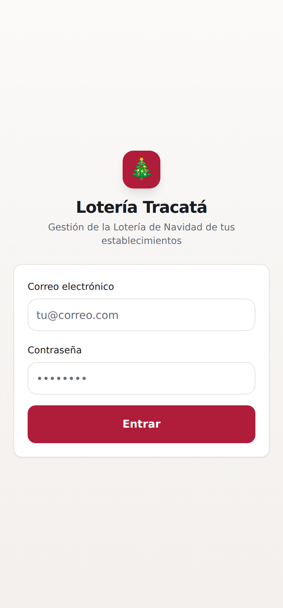

**Instalarla como una aplicación más** (recomendado: se abre a pantalla completa y con su
icono, sin la barra del navegador):

- **iPhone:** abre la dirección en **Safari** → botón *Compartir* → **Añadir a pantalla de inicio**.
- **Android:** abre la dirección en **Chrome** → menú de los tres puntos → **Instalar aplicación**.

> **Hace falta conexión a internet.** Si te quedas sin cobertura, la aplicación te avisa con
> una pantalla de «No hay conexión»: las cifras tienen que ser siempre las reales, así que no
> se guardan datos antiguos en el móvil.

---

## 3. La pantalla de Inicio

Es el resumen de toda la campaña. Es lo primero que ves al abrir la aplicación:

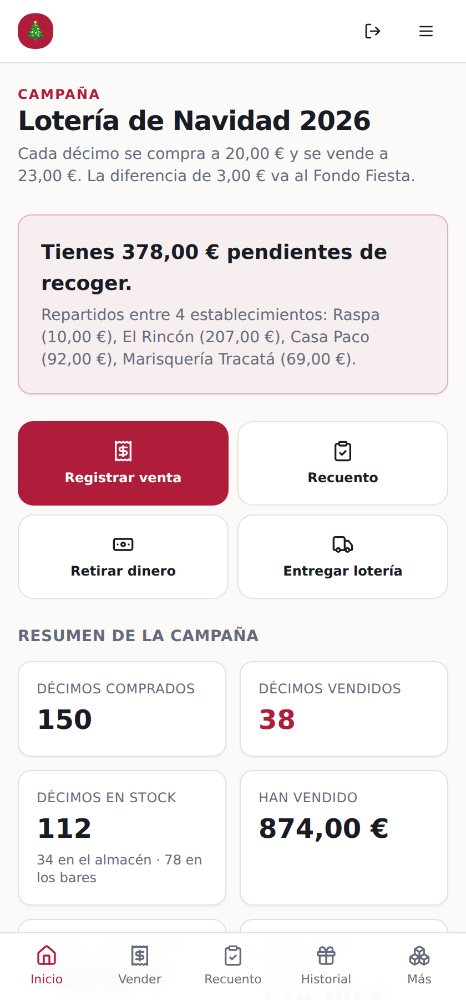

**1. El aviso de arriba** te dice, de un vistazo, **cuánto dinero tienes por recoger** y en
qué establecimientos está.

**2. Los accesos rápidos**: *Registrar venta*, *Recuento*, *Retirar dinero* y *Entregar lotería*.

**3. El resumen de la campaña**, cifra a cifra:

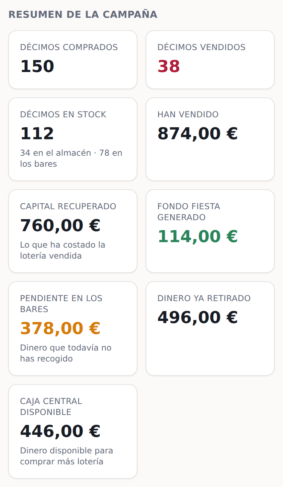

| Cifra | Qué significa |
| --- | --- |
| **Décimos comprados** | Todos los que has comprado en la administración |
| **Décimos vendidos** | Los que se han vendido en total |
| **Décimos en stock** | Los que quedan sin vender (en tu almacén + en los bares) |
| **Han vendido** | Dinero total de las ventas (décimos vendidos × 23 €) |
| **Capital recuperado** | Lo que costó esa lotería vendida (× 20 €) |
| **Fondo Fiesta generado** | Lo que llevas acumulado para la fiesta (× 3 €) |
| **Pendiente en los bares** | Dinero vendido que **todavía no has recogido** |
| **Dinero ya retirado** | Lo que ya has recogido de los bares |
| **Caja central disponible** | Dinero que tienes ahora para comprar más lotería |

**4. Una tarjeta por establecimiento.**

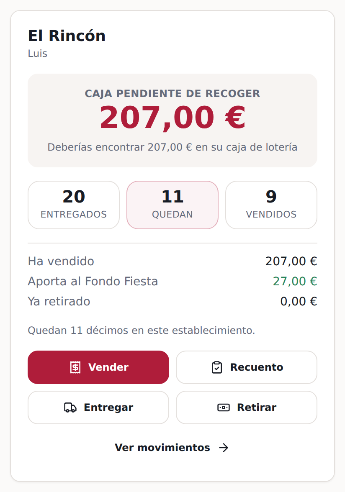

El dato grande del centro es el importante:
**la caja pendiente de recoger**, es decir, el dinero que deberías encontrar hoy en ese bar.

- En **rojo/granate**: hay dinero por recoger.
- En **verde 0,00 €**: está todo recogido.
- En **rojo con importe negativo**: has retirado de más (ese bar tiene saldo a su favor).

Debajo, los décimos *entregados*, los que *quedan* y los *vendidos*, y los botones para
actuar sobre ese establecimiento sin buscarlo en ningún menú.

---

## 4. Cómo moverte por la aplicación

En el móvil tienes **una barra fija abajo** con lo que más se usa: *Inicio*, *Vender*,
*Recuento*, *Historial* y *Más* (se ve en la imagen anterior).

Con el botón **☰** de arriba a la derecha se abre el menú completo, y con **Más** llegas a
todas las secciones y operaciones:

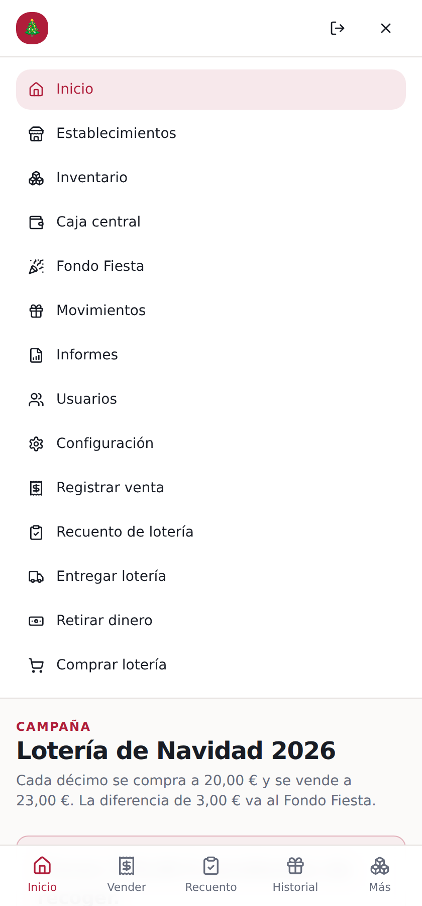
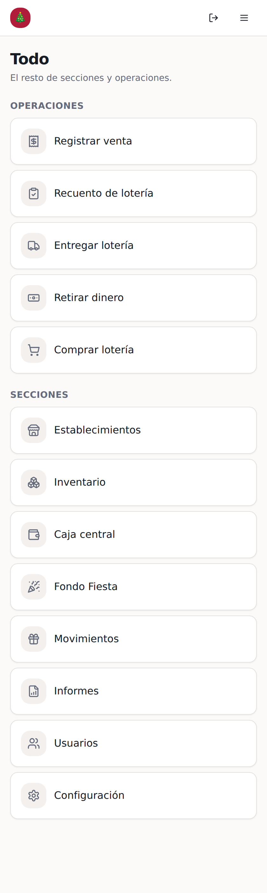

En ordenador se ve lo mismo, con el menú en una columna a la izquierda:

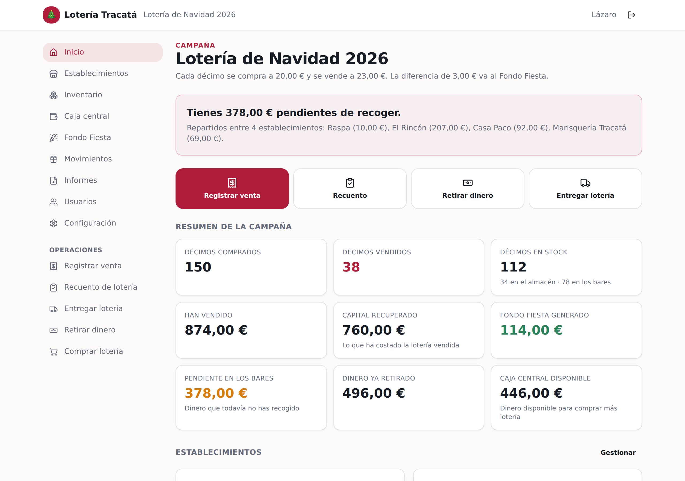

El botón **⇥** de la cabecera cierra la sesión.

---

## 5. El día a día: vender, contar y recoger el dinero

### 5.1. Registrar una venta

Cada vez que un bar vende décimos, se apunta aquí. **Inicio → Registrar venta** (o el botón
*Vender* de la tarjeta del establecimiento, que ya te lo deja elegido).

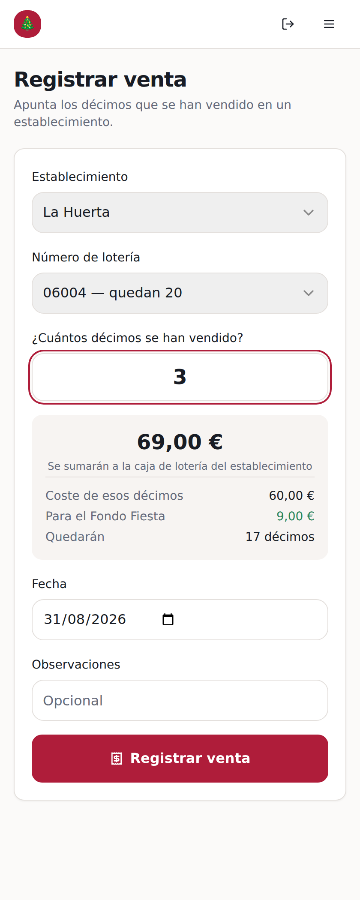

1. Elige el **establecimiento**.
2. Elige el **número de lotería**. Al lado te dice cuántos quedan de ese número.
3. Escribe **cuántos décimos** se han vendido.
4. La aplicación te enseña el resultado antes de guardar: el dinero que se suma a la caja de
   ese bar, lo que va al Fondo Fiesta y cuántos décimos quedarán.
5. Cambia la **fecha** si la venta fue otro día, y pulsa **Registrar venta**.

> No se pueden vender más décimos de los que hay en ese establecimiento: la aplicación no te
> deja y te dice cuántos quedan.

### 5.2. Hacer un recuento

Es la forma cómoda de ponerse al día cuando en el bar no han ido apuntando venta a venta:
**cuentas los décimos que quedan de verdad** y la aplicación deduce lo vendido.

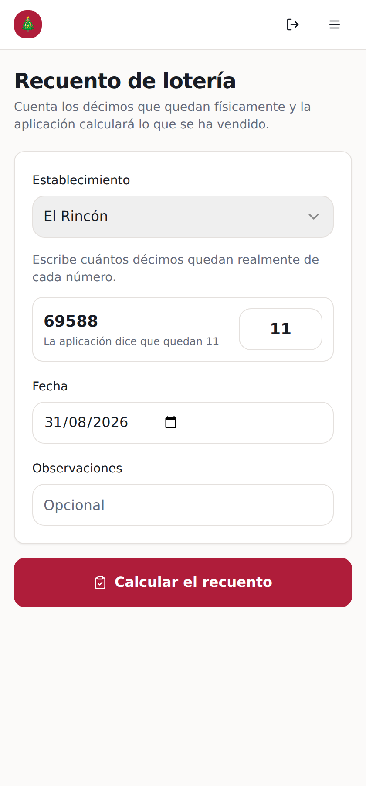

1. Elige el establecimiento.
2. Escribe cuántos décimos quedan **realmente** de cada número (debajo te recuerda cuántos
   dice la aplicación que debería haber).
3. Pulsa **Calcular el recuento**.

La aplicación **nunca cambia nada en silencio**: primero te enseña lo que va a registrar y
espera tu confirmación.

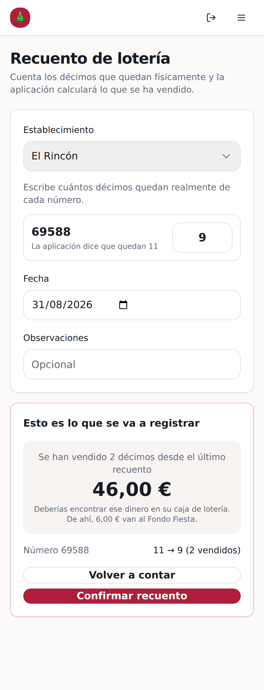

- Si **faltan** décimos, se registran como **ventas** y verás el dinero que debería haber en
  la caja de ese bar.
- Si **sobran** décimos, se registra un **ajuste** explicándolo, para que quede constancia.
- Si **todo cuadra**, se guarda el recuento como comprobación, sin cambiar nada.

Revisa la propuesta y pulsa **Confirmar recuento**, o **Volver a contar** si te has equivocado.

### 5.3. Retirar el dinero

Cuando pasas por el bar a recoger la recaudación: **Retirar dinero** (solo administrador).

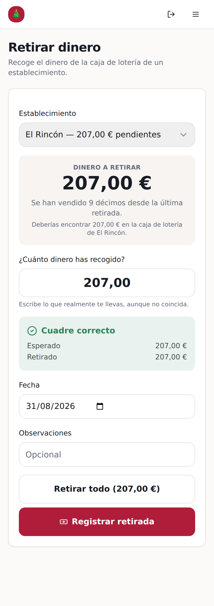

1. Elige el establecimiento. Arriba verás **cuánto deberías encontrar** y cuántos décimos se
   han vendido desde la última vez que pasaste.
2. Escribe **lo que realmente te llevas**. El botón *Retirar todo* rellena el importe esperado.
3. La aplicación te enseña el cuadre al momento:

| Semáforo | Qué significa |
| --- | --- |
| 🟢 **Cuadre correcto** | Te llevas exactamente lo esperado |
| 🟠 **Faltan X €** | La diferencia **sigue pendiente** en ese bar |
| 🔴 **Has recogido X € de más** | Ese bar queda con saldo a su favor |

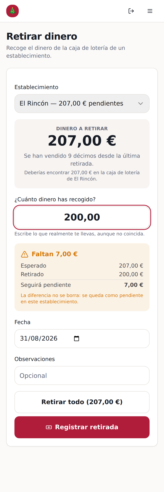

4. Apunta en **Observaciones** lo que convenga («faltaban 10 €») y pulsa **Registrar retirada**.

> **Importante:** apunta siempre lo que te llevas de verdad, aunque no coincida. La diferencia
> no se borra ni se maquilla: se queda como pendiente y la verás en la tarjeta del bar hasta
> que se resuelva.

---

## 6. Operaciones del administrador

Estas pantallas solo las ve el administrador.

### 6.1. Comprar lotería

Registra los décimos que compras en la administración de loterías.

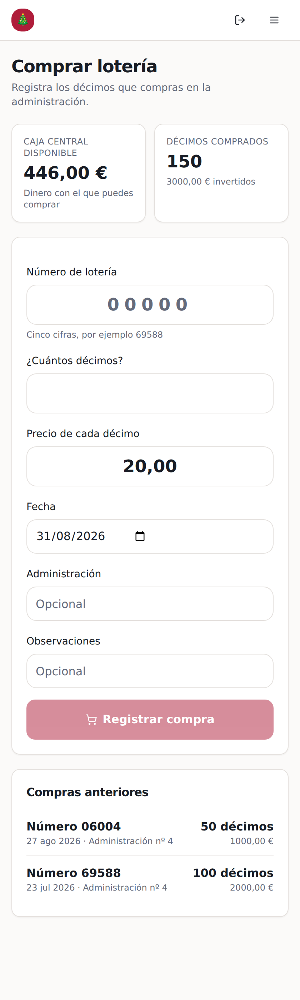

- Arriba tienes el dinero disponible en la caja central y lo que llevas comprado.
- Se apunta el **número** (5 cifras), **cuántos décimos** y, si hace falta, un precio distinto
  al de la campaña (en ese caso la aplicación te avisa en naranja de la diferencia que dejará
  en la caja central).
- Comprar más décimos de un número que ya tenías **suma** al stock, no lo sustituye.
- La compra **baja la caja central** y los décimos entran en tu **almacén**.
- Debajo queda la lista de compras anteriores.

### 6.2. Entregar lotería a un bar (y recogerla)

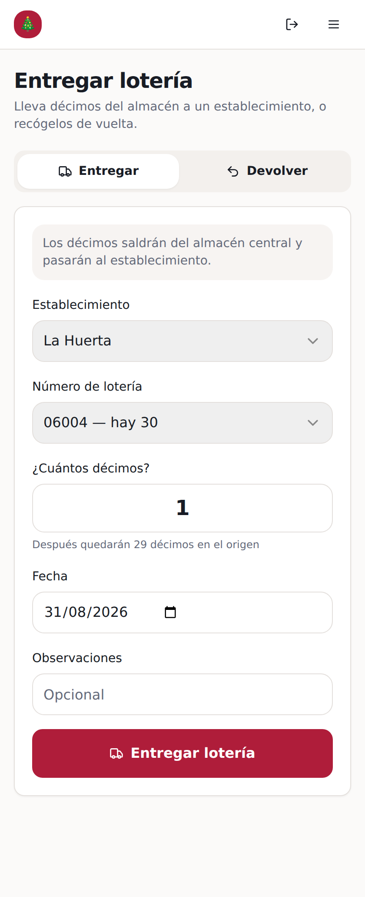

Dos modos en la misma pantalla:

- **Entregar**: saca décimos de tu almacén y los lleva a un establecimiento.
- **Devolver**: los que sobran en un bar vuelven al almacén.

Elige el establecimiento, el número y la cantidad. No se puede entregar más de lo que hay
en el almacén, ni devolver más de lo que tiene el bar.

### 6.3. Caja central

El dinero del proyecto: de dónde sale y en qué se va.

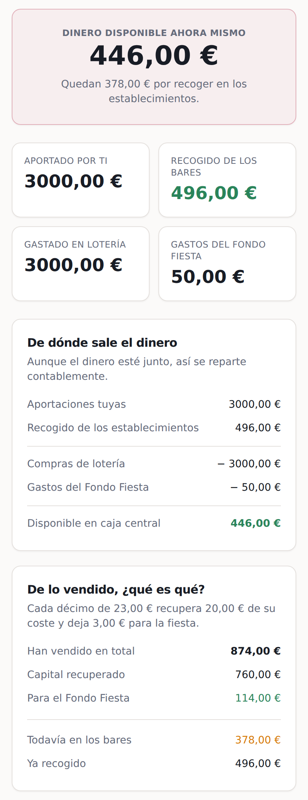

- Arriba, el **dinero disponible ahora mismo** y lo que queda por recoger en los bares.
- **De dónde sale el dinero**: tus aportaciones + lo recogido de los bares − compras de
  lotería − gastos de la fiesta.
- **De lo vendido, ¿qué es qué?**: cuánto es recuperar el coste y cuánto es fondo para la fiesta.
- **Añadir dinero a la caja central**: si pones dinero de tu bolsillo para arrancar o para
  comprar más lotería, se apunta aquí (importe, concepto y fecha).
- Abajo, todos los movimientos de dinero, con su signo: en verde lo que entra, en rojo lo que sale.

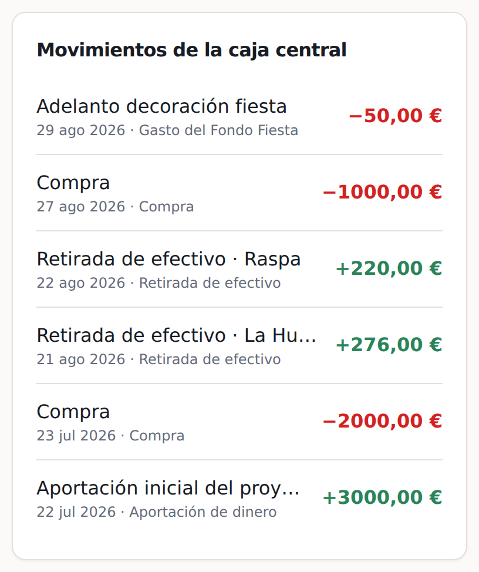

### 6.4. Fondo Fiesta

Lo que se va acumulando para la fiesta del personal: 3,00 € por cada décimo vendido.

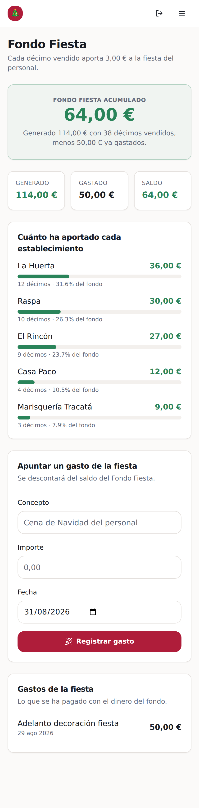

- El **saldo acumulado** (generado − gastado).
- **Cuánto ha aportado cada establecimiento**, con su barra y su porcentaje.
- **Apuntar un gasto de la fiesta**: concepto, importe y fecha. El gasto baja el fondo y
  también la caja central (el dinero sale de ahí).

---

## 7. Consultar y comprobar

### 7.1. Inventario

Dónde está cada décimo en este momento: en tu almacén, en cada bar, y el resumen por número.

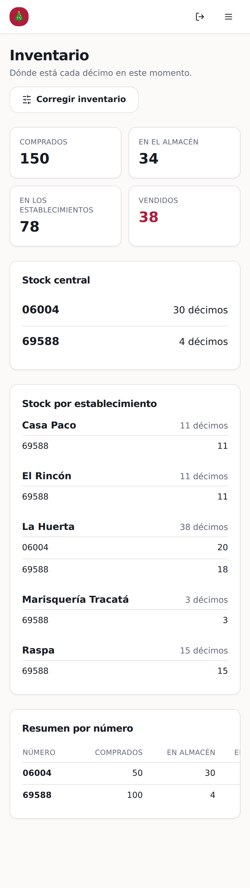

Abajo del todo, el resumen por número: cuántos compraste, cuántos quedan en el almacén,
cuántos están repartidos por los bares y cuántos se han vendido.

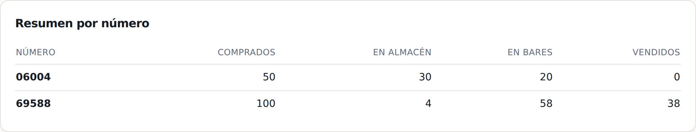

El botón **Corregir inventario** (solo administrador) es para lo que no es una venta: un
décimo roto, perdido o apuntado por error. Se elige el número, si faltan o sobran, cuántos y
**el motivo**, y queda registrado en el histórico.

### 7.2. Movimientos (el histórico)

Todo lo que ha pasado, en orden, contado en lenguaje normal: quién lo hizo, cuándo y con qué
efecto sobre el Fondo Fiesta.

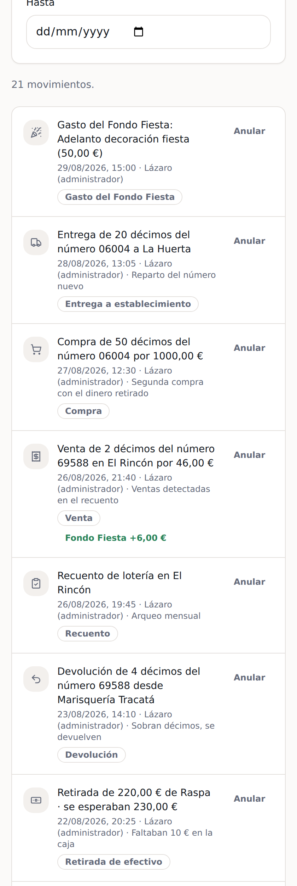

Arriba puedes filtrar por establecimiento, número, tipo de movimiento y fechas.

**Si te has equivocado en algo, se anula.** Pulsa **Anular** en la línea correspondiente:

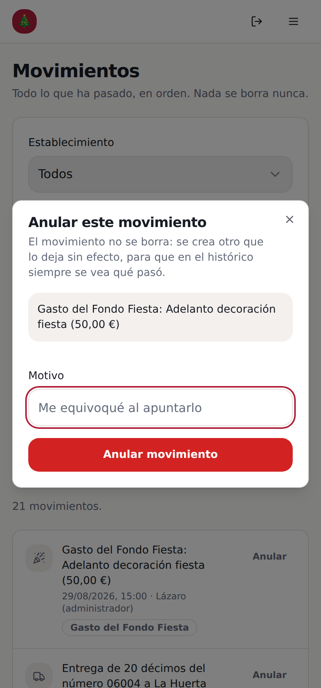

Escribe el motivo y confirma. El movimiento original **no se borra**: queda tachado y marcado
como *Anulado*, y aparece un movimiento nuevo de *ANULACIÓN* que lo deja sin efecto. Así
siempre se ve qué pasó de verdad. Si el movimiento formaba parte de una operación con varias
líneas (por ejemplo una compra de varios números), se anula la operación completa.

### 7.3. Informes

Resúmenes de la campaña, filtrables por establecimiento, número, tipo y fechas.

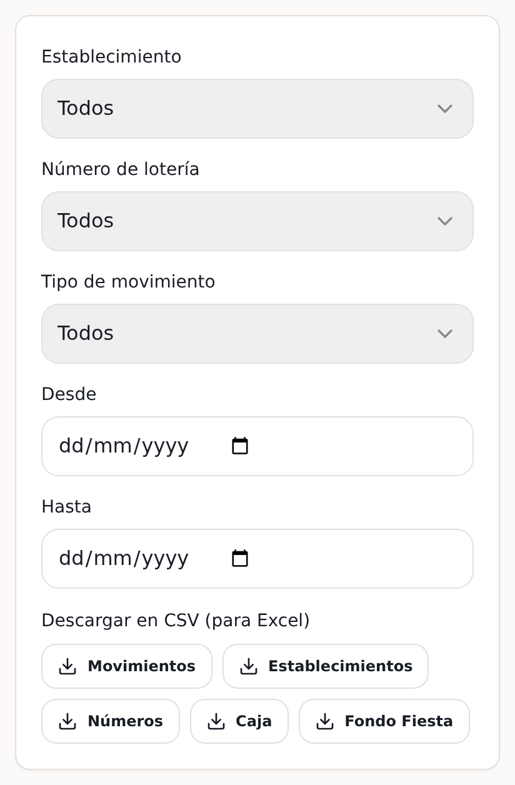

Debajo de los filtros están los informes ya calculados: el general de la campaña (o del
periodo que hayas filtrado), el de cada establecimiento, el de cada número, el de caja y el
del Fondo Fiesta.

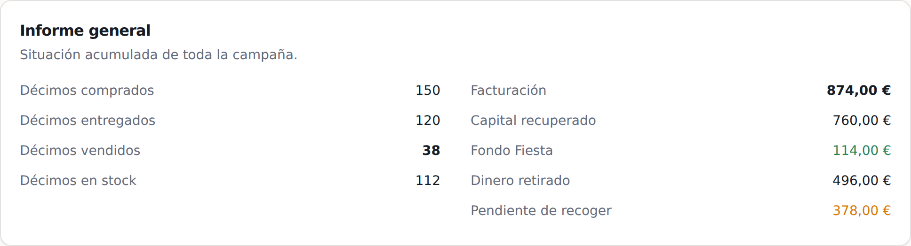
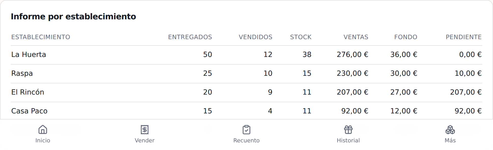

- **Descargar en CSV** (se abre con Excel): movimientos, establecimientos, números, caja y fondo.
- **Imprimir o guardar en PDF**: imprime solo el contenido, sin menús.

### 7.4. Establecimientos

La lista de bares y restaurantes, con su resumen y el botón para **crear** o **editar** uno
(nombre, responsable, notas). Un establecimiento que ya tiene movimientos no se puede borrar:
para dejar de usarlo se desmarca la casilla **«Activo»** y su histórico se conserva intacto.

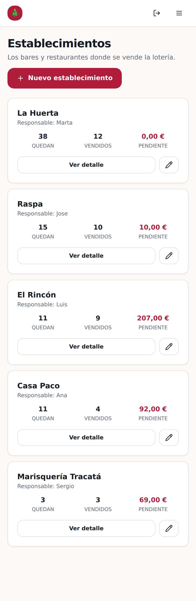

Al entrar en uno tienes su ficha completa: caja pendiente, última retirada, décimos por
número y todos sus movimientos.

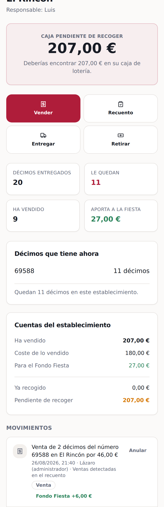

### 7.5. Usuarios

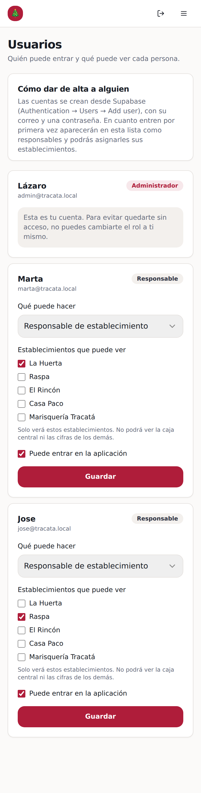

Las cuentas se crean en Supabase (*Authentication → Users → Add user*) con su correo y una
contraseña. La primera vez que esa persona entra, aparece en esta lista y aquí decides:

- **Qué puede hacer**: *Responsable de establecimiento* o *Administrador*.
- **Qué establecimientos ve** (en el caso de un responsable).
- Si su acceso está **activo** o no.

### 7.6. Configuración

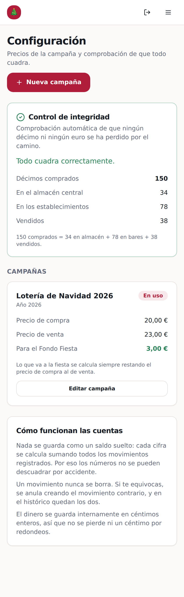

- **Control de integridad**: una comprobación automática de que no se ha perdido ni un décimo
  ni un euro. Si dice «Todo cuadra correctamente», las cuentas están bien. Si alguna vez
  avisara de un descuadre, te dice exactamente dónde está.
- **Campañas**: el nombre, el año y los **precios de compra y de venta**. Lo que va al Fondo
  Fiesta se calcula siempre restando uno del otro. Para el año que viene se crea una campaña
  nueva y se marca como «En uso»; la anterior se queda con todo su histórico.

---

## 8. Si eres responsable de un bar

Si no eres administrador, la aplicación te enseña **solo lo tuyo**: tu establecimiento, tus
ventas y tu aportación a la fiesta. No verás la caja central, ni las cifras de los demás
bares, ni las opciones de comprar, entregar o retirar dinero.

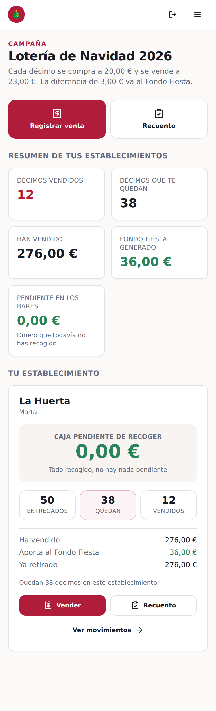

Lo que sí puedes hacer es lo del día a día:

- **Registrar las ventas** de tu establecimiento.
- **Hacer recuentos** de lo que queda.
- Ver **tu caja pendiente** (el dinero de lotería que deberías tener guardado) y tu histórico.

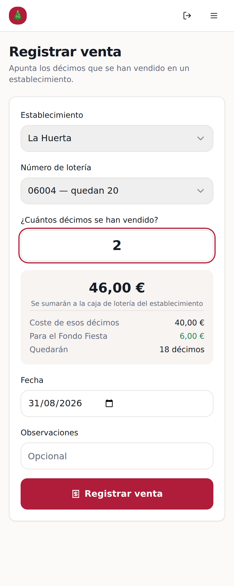
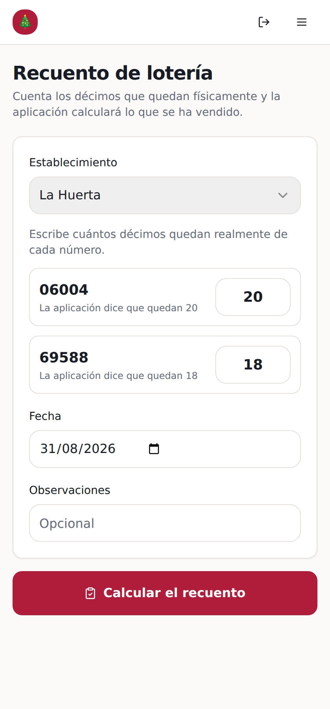

En **Fondo Fiesta** ves lo que tu establecimiento lleva aportado a la fiesta del personal
(el total del fondo y los gastos los lleva el administrador):

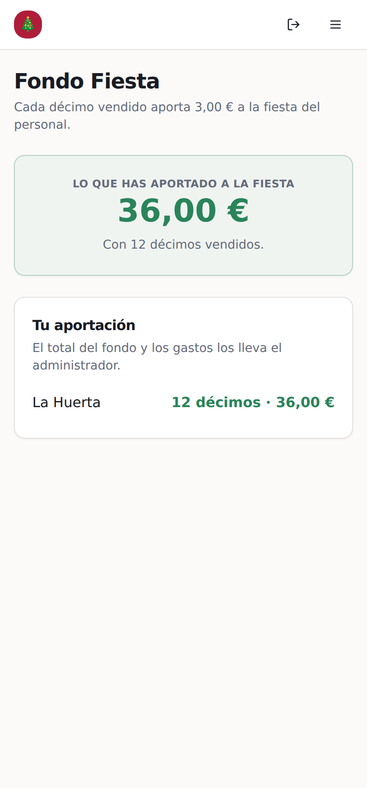

Y en **Más** tienes el resto de secciones que sí puedes consultar:

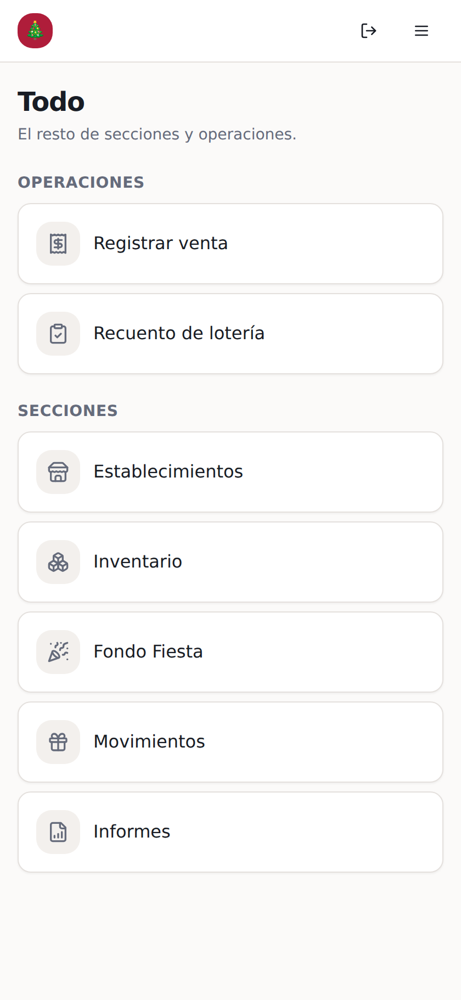

> Esto no es solo que los botones estén escondidos: los permisos se aplican en la propia base
> de datos, así que nadie puede ver ni tocar lo que no le corresponde.

---

## 9. Preguntas frecuentes

**Me he equivocado al apuntar una venta.**
Ve a **Movimientos**, busca la línea y pulsa **Anular**. Se crea el movimiento contrario y las
cifras vuelven a su sitio. Después apunta la venta correcta.

**En la caja del bar hay menos dinero del que dice la aplicación.**
Apunta en **Retirar dinero** lo que realmente te llevas. La diferencia se queda como pendiente
en ese establecimiento y seguirá viéndose hasta que aparezca el dinero (o hasta que decidas
qué hacer con ella). Usa las *Observaciones* para explicarlo.

**En el bar no han apuntado las ventas.**
No pasa nada: haz un **Recuento**. Cuentas los décimos que quedan y la aplicación calcula las
ventas y el dinero que debería haber.

**Se ha roto o perdido un décimo.**
**Inventario → Corregir inventario**, indicando qué ha pasado y el motivo. No lo apuntes como
venta: no hay dinero detrás.

**A un bar se le han acabado los décimos.**
**Entregar lotería** (administrador): del almacén al establecimiento.

**Sobran décimos en un bar y quiero llevarlos a otro.**
Primero **Devolver** al almacén (en la pantalla *Entregar lotería*) y después **Entregar** al
otro establecimiento.

**No veo «Retirar dinero» ni «Caja central».**
Esas opciones son solo del administrador. Si crees que deberías tenerlas, que te cambien el
permiso en **Usuarios**.

**Quiero cambiar el precio de venta.**
**Configuración → Campañas**. Ojo: afecta a las ventas que registres a partir de ese momento.

**¿Se pierde algo si cierro la aplicación?**
No. Todo se guarda en el momento de pulsar el botón, y se ve igual desde cualquier móvil u
ordenador con tu usuario.

**Me sale «No hay conexión».**
Necesitas internet para ver las cifras reales. Vuelve a intentarlo cuando tengas cobertura.

---

## 10. Chuleta rápida

| Quiero… | Voy a… |
| --- | --- |
| Apuntar que se han vendido décimos | **Vender** |
| Ponerme al día contando lo que queda | **Recuento** |
| Recoger el dinero de un bar | **Retirar dinero** |
| Llevar décimos a un bar | **Entregar lotería** |
| Recuperar décimos que sobran | **Entregar lotería → Devolver** |
| Comprar más lotería | **Comprar lotería** |
| Ver cuánto dinero tengo | **Caja central** |
| Ver cuánto llevamos para la fiesta | **Fondo Fiesta** |
| Saber dónde está cada décimo | **Inventario** |
| Ver o deshacer algo que se apuntó | **Movimientos** |
| Sacar los datos a Excel o en PDF | **Informes** |
| Dar permisos a alguien | **Usuarios** |
| Cambiar precios o comprobar que cuadra | **Configuración** |

**Las tres reglas de oro**

1. Apunta siempre **lo que ha pasado de verdad**, aunque no cuadre. La aplicación está hecha
   para que las diferencias se vean, no para taparlas.
2. Si te equivocas, **anula**; no intentes «arreglarlo» con otra venta o con un ajuste.
3. Antes de recoger dinero en un bar, un **recuento** rápido te evita sorpresas.
